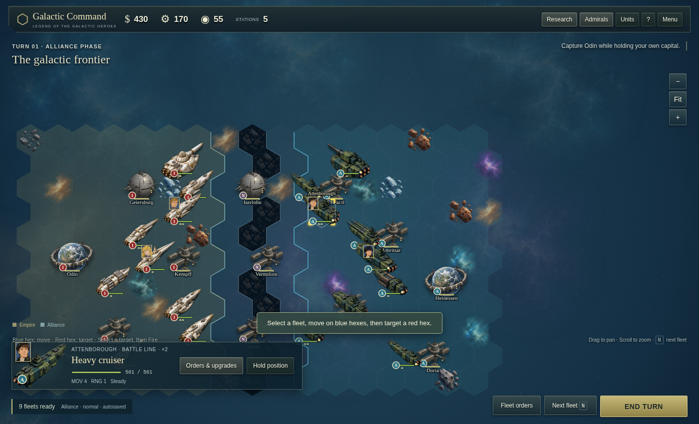

# Galactic Command — complete site source

This contains the complete published game, including the new Empire and Alliance artwork, ten ship classes, updated combat rules, and saved-campaign migration.

## Play online

https://user2421423.github.io/LOGH/ — deployed automatically from `dist/` by `.github/workflows/pages.yml`. Local tests are optional and are not a deployment prerequisite.

## WC4-style controls and HUD

- **One-click attacks:** click (or press Enter on) a red hex to fire immediately. Hover first to see the expected damage and counter-fire.
- **Undo move:** a fleet that has moved but not fired can be sent back with the **Undo move** button or **Z**. Any attack, purchase or other order locks in earlier moves.
- **Standing courses:** select one of your fleets and choose **Set course** (or press **G**), then click any navigable sector. The fleet advances toward that destination automatically at the start of each future turn and still retains its attack for that turn. Hold position or Clear course cancels the route.
- **Resources:** Credits (gold $ coin), Industry (gear and ingot) and Research (microchip).
- **Map tokens:** Imperial fleets stand on navy plates with gold trim, Alliance fleets on crimson plates with silver trim, ringed by a green → yellow → red hull gauge. Metallic bars show 1–3 stacks, and admirals appear as framed portraits with rank stars above their fleets.
- **Combat juice:** synthesized weapon sounds per hull class and faction (🔊 button mutes), floating damage with red **CRIT!** numbers, blue station-defense tags, **MORALE ↓ / CONFUSED / LOW SUPPLY** alerts, and camera shake on heavy hits.
- **Fortress main guns:** select your own Iserlohn (Thor's Hammer) or Geiersburg and click a red hex to strike an enemy fleet within 3 hexes for 40% of its hull. Two-turn recharge; silenced while shields are down. Nothing fires automatically.
- **Station buildings:** every station has a Shipyard (larger hulls, +10 industry per level), a Research station (+8 research per level; research banked at victory becomes command tokens) and an Air base, each upgradable to level 3.
- **Station-launched airstrikes:** Fighter, Bomber and Strategic Bomber sorties are paid actions from Air Base levels 1–3. Select a station and click **Air Sorties** to open its dedicated aerospace command panel (separate from station information). Choose a sortie, then click a highlighted enemy. The existing aircraft PNGs are cropped at render time to show a **single aircraft** for Fighters, Bombers, and Strategic Bombers on both factions (original image files unchanged). Each sortie flies out to its target, plays the impact effect, turns, and returns to its launch base at the original map-unit sprite size. There are no per-turn sortie limits: every flight deducts credits and industry, and the aircraft use the original faction-specific artwork for their flight animations. Aerospace research improves range, cost, penetration, and attack. Aircraft no longer occupy map hexes or capture stations. The AI launches sorties too, **only after purchasing fleets and reinforcements**, preserving enough resources for at least another frigate. It chooses fleet-killing strikes by effective damage per cost, plans coordinated shield-breaking salvos only when friendly fleets are approaching, and upgrades air bases from surplus funds.
- **Conquest:** the galactic frontier is now a 51 × 29 galaxy with 44 named systems: 21 Imperial, 21 Alliance, plus neutral Iserlohn and Fezzan. A three-column gravity rift divides the powers and is passable only through two **three-hex-wide corridors**, creating separate northern and southern operational axes. Iserlohn and Fezzan control their three-lane crossings: hostile and neutral station shields block flanking movement through the central rift column until bombarded down; after a shield breach, fleets can maneuver around the station through two extra lanes. Defenders retain access to their own protected lanes, and the rest of the gravity rift stays impassable. Each side begins with 16 permanent fleets spread between its core and both approaches. Win by taking both capitals or holding more stations at the 80-turn armistice. Enemy high command organizes fleets into persistent fronts, keeps a strategic reserve, masses offensive fleets at rally stations, and now procures reinforcements for each reachable front rather than following a fixed ship list: it reacts to enemy fleet composition, reserves resources for new construction, reinforces high-value fleets selectively, uses route distance through the corridors, deploys new ships toward their assigned front and shifts rear yards into reserve production when required.
- **Scenarios:** Assault on Iserlohn, Battle of Astarte, Hold Amritsar and Battle of Vermilion, each with one objective, a turn limit and a saved 1–3 star rating.
- **HQ research with command tokens:** as in World Conqueror 4, technology is bought at Command HQ with command tokens and kept across every operation and side. Tokens come only from the first victory in each operation at each difficulty (250, plus 50 per star or 150 for a Conquest, plus 1 per 5 research banked; ×1.5 on Hard, ×2 on Challenge; 150 extra for the first win ever). Replays pay nothing. 37 technologies in five trees: Escort, Battle Line, Artillery, Aerospace and Stations. They cover weapons, armor, hull, engines, class counters, Assault Doctrine breakthroughs, Fire Control, Long-Range Sorties, Fortification and Thor Overcharge. Tiers II–IV open after 2, 4 and 7 victories.
- **Difficulty (Normal / Hard / Challenge):** Normal is each operation as designed. Hard gives every enemy side all tier I–II HQ research, upgrades every other enemy fleet one class (escort → light cruiser, cruiser → heavier hull, artillery likewise), adds one fleet per four and makes enemy admirals one rank higher. Challenge gives them every technology, upgrades every fleet with an extra stack, adds one fleet per two, two admiral ranks and +25% enemy income. AI procurement intelligence also scales with difficulty: Normal only lightly adapts its fleet mix, Hard counters enemy branches much more strongly, and Challenge additionally alternates combat/support construction to assemble more deliberate combined forces. Best stars and rewards are tracked per difficulty.
- **Admiral Info and token stars:** click any admiral portrait (map, panel, dock or Admirals menu) for a WC4-style card. As WC4 spends medals, command tokens buy extra branch and Movement stars (60 / 120 / 220 / 360 tokens for the 3rd–6th star, up to 6). Movement stars add fleet movement: 3★ +1 hex, 4★ +2, 5★ +3, 6★ +4 (1★ −1). Stars are saved with the officer and carry into every mode and difficulty.
- **Recruitable admirals:** 22 more admirals, none placed in any operation, recruitable in HQ → Admirals. Empire: Bittenfeld, Müller, Fahrenheit, Kempff, Eisenach, Oberstein, Wahlen, Lutz, Mecklinger, Kessler, Steinmetz, Lennenkampf. Alliance: Bucock, Merkatz, Ulanhu, Borodin, Cazerne, Poplin, Konev, Murai, Patrichev, Nguyen. Signature abilities emphasize battlefield behavior rather than flat stats: Reinhard inspires attacks, Mittermeyer and Attenborough maneuver after combat, Reuenthal rewards flanking, Kircheis protects command fleets, Fischer coordinates movement, Bittenfeld pursues, Müller anchors commanders, Kempff coordinates air/artillery strikes, Eisenach rewards formation discipline, Wahlen holds ground, Lutz designates targets, Kessler guards stations, Ulanhu organizes withdrawals, Poplin gains evasive moves after kills, Nguyen raids isolated fleets, Lennenkampf fights in line, and Borodin excels in a last stand.
- **Campaigns (WC4-style):** an Empire campaign (Third Battle of Tiamat, Astarte, Amritsar Counteroffensive, Lippstadt War, Eighth Battle of Iserlohn with Geiersburg, Operation Ragnarök, Vermilion: Hold the Line, Rantemario, the Corridor) and an Alliance campaign (Astarte: The Second Fleet, Seventh Battle of Iserlohn, Hold Amritsar, Alliance Civil War, Defense of Iserlohn, Ragnarök: Defend Heinessen, Vermilion, Mar-Adetta, the Corridor). The Lippstadt and Ragnarök chapters are fought on the former Conquest start-date maps with their special rules. Chapters unlock in order once the previous one is won on any difficulty.
- **Airstrike targeting overlay:** choose a sortie in a friendly station's aerospace panel. Eligible targets within the launch range glow red, and the existing fighter/bomber formation assets animate each strike. Aircraft are not persistent units, and sorties cannot skip across the central gravity rift.
- **Your admirals vs. scenario commanders (WC4-style):** admirals that come with a scenario or Conquest start date stay on their fleets with fixed stats and cannot be upgraded. Your own admirals live in HQ → Admirals (start menu or in-game Admirals menu): two per side to start (Reinhard and Mittermeyer, Yang and Attenborough), the rest recruited once with command tokens (400 five-star, 300 four-star, 200 three-star recruitables). Promote them through eleven naval ranks (fleet hull 112% to 160%), buy branch and Movement stars and equip medals there; assign them to any fleet in any operation on their side, even beside the scenario's own version.
- **Clear disabled orders:** unaffordable costs turn red on the resource you are short of; other unavailable buttons say why, e.g. "Already fired", "No friendly station nearby".
- **Economy:** both sides start with 300 credits and 250/turn. Escorts give the most firepower per credit, flagships the most per hex at about two turns of income; extra stacks cost 85% of a hull, field reinforcement a full hull, repairs a fifth of the fleet's price.

Saves from earlier versions are not loaded (rules version 11).

## Run the game

1. Extract this ZIP.
2. Open a terminal in the extracted `galactic-command` folder.
3. Run:

```sh
python3 -m http.server 8000 --directory dist
```

4. Open http://localhost:8000 in your browser.
5. Press Ctrl+C in the terminal to stop the server.

There are no npm dependencies, build steps, API keys, or external services required to play. The game runs entirely in the browser. Python is used only to serve the files locally. Any other static web server works too.

You can also try opening `dist/index.html` directly in your browser. Serving the folder as above is recommended for consistent browser handling of assets and saved games.

## Files

- `dist/index.html` — entry page
- `dist/engine.js` — core deterministic rules, combat, economy, saves, and public API
- `dist/engine/admirals.js` — admiral roster and starting ratings
- `dist/engine/research.js` — HQ research trees and technology data
- `dist/engine/galaxy.js` — Conquest eras and galaxy definitions
- `dist/engine/campaign.js` — scenario and campaign definitions
- `dist/engine/orders.js` — standing-course pathfinding and automatic movement
- `dist/engine/ai.js` — theater/front planning, reserves, rallying, production and tactical AI
- `dist/ui/orders.js` — standing-order targeting UI state
- `dist/game.js` — main interface, battlefield rendering, dialogs and browser saves
- `dist/art.js` — artwork loading and sprite definitions
- `dist/style.css`, `dist/battlefield.css` — interface styling
- `dist/assets/empire-fleet.png` — white/gold Imperial ships
- `dist/assets/alliance-fleet.png` — olive/teal Alliance ships
- `dist/assets/fleet-atlas.png` — stations, fortresses, and capitals
- `dist/assets/terrain-atlas.png` — terrain and effects
- `dist/assets/admiral-atlas.png` — admiral portraits
- `tests/engine.test.cjs` — nine essential movement, combat, economy, corridor and save checks
- `tests/production-ai.test.cjs` — three essential shipbuilding and airstrike-AI checks
- `tests/ui-smoke.cjs` — one minimal browser-interface smoke script (both factions, saves, shortcuts and turns)
- `ASSETS.md` — artwork notes, sprite mappings, and generation prompts
- `.openai/hosting.json` — existing Sites deployment configuration

## Edit or host elsewhere

Edit the files in `dist/`, then refresh the browser. To host the game elsewhere, upload the entire contents of `dist/` while preserving the `assets/` folder. The `.openai/hosting.json` project ID refers to the original Site; it is not needed by other static hosts.

## Optional tests

The lean safety net contains **12 engine/AI tests and one UI smoke script**. Detailed feature-by-feature regression cases were removed to keep maintenance simple. With Node.js installed, run from this folder:

```sh
node --test tests/engine.test.cjs tests/production-ai.test.cjs
node tests/ui-smoke.cjs
```

## Saved games

Progress lives in the browser's local storage under `galactic-command-hex-v2`. This package includes the code to migrate older campaigns, but it does not include your browser's save data. The hosted Site and localhost use separate save storage.

## Source snapshot

Published source commit: 9fe16dc9205f02ddf6e32ddb9c83ae01dedac584
Packaged: 5 October 2026

Unofficial Legend of the Galactic Heroes fan game with WC4-inspired rules and original generated artwork.

## Screenshot



## Code review

See [REVIEW.md](REVIEW.md).
